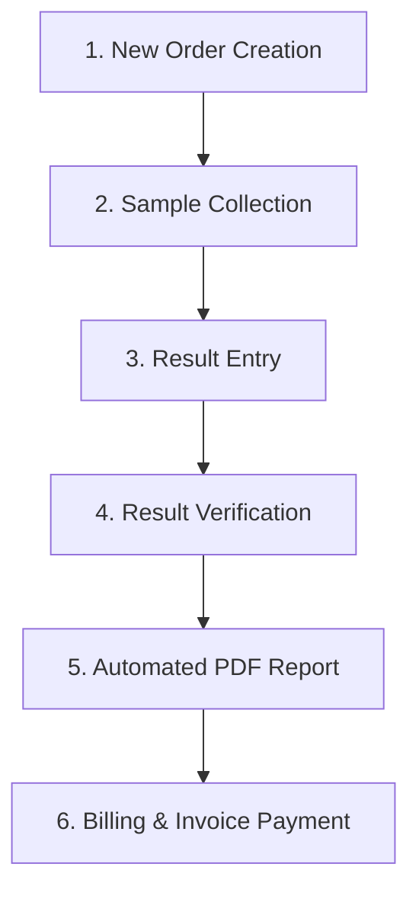

# PulseQ Laboratory Portal — Complete Setup & Architecture Guide

This document provides a comprehensive, step-by-step guide for setting up, configuring, running, and troubleshooting the **PulseQ Laboratory Portal** (Backend & Frontend).

---

## 1. System Overview & Technology Stack

The **Laboratory Portal** is a multi-tenant diagnostic laboratory management system capable of operating in **Standalone Mode** or **PulseQ Connected Integration Mode**.

### Technology Stack
- **Backend**:
  - **Framework**: Python 3.11+ with [FastAPI](https://fastapi.tiangolo.com/)
  - **Database**: SQLite (default for zero-config dev) or PostgreSQL via [SQLAlchemy 2.0](https://www.sqlalchemy.org/)
  - **PDF Generation**: [ReportLab](https://www.reportlab.com/) (rendered to A4 format with color palettes matching design tokens)
  - **Real-Time Messaging**: Starlette WebSockets with in-memory & Upstash Redis Pub/Sub relay
  - **Object Storage**: Cloudflare R2 / S3-compatible storage for cloud report archival (with local disk fallback)
- **Frontend**:
  - **Framework**: [Angular 19](https://angular.dev/) (Standalone Components, Signals, Reactive RxJS)
  - **Styling**: Vanilla CSS Design Tokens, Glassmorphism Cards, Dark/Light surface contrast
  - **Icons & UI**: PrimeIcons (`pi`)

---

## 2. Codebase Structure

```text
Lab/
├── LAB_PORTAL_SETUP.md           # This setup & architecture documentation
├── backend_review.md             # Architecture review & design blueprint
├── backend/                      # FastAPI Python Service (Port 8123)
│   ├── app/
│   │   ├── main.py               # FastAPI App initialization, CORS & router mounting
│   │   ├── config.py             # Environment configuration & defaults
│   │   ├── database.py           # SQLAlchemy engine & session factory
│   │   ├── db_models.py          # SQLAlchemy models (Orders, Catalog, Inventory, Invoices, etc.)
│   │   ├── models.py             # Pydantic validation schemas
│   │   ├── schemas.py            # API request/response models
│   │   ├── security.py           # JWT Authentication & role verification guards
│   │   ├── reporting.py          # ReportLab PDF report generator
│   │   ├── realtime.py           # WebSocket connections & event broadcasting
│   │   ├── routes/               # API Routers
│   │   │   ├── auth.py           # Login & Token endpoints
│   │   │   └── laboratory_portal.py # Orders, Results, Catalog, Inventory, Billing
│   │   └── services/
│   │       ├── laboratory_service.py # Core business logic & database queries
│   │       └── storage_service.py    # Cloudflare R2 upload helper
│   ├── reports/                  # Local PDF report storage directory
│   ├── pulseq.db                 # Development SQLite database
│   ├── requirements.txt          # Python dependencies
│   └── venv/                     # Python virtual environment
│
└── PulseQ-Lab/                   # Angular 19 Single Page Application
    ├── src/
    │   ├── app/
    │   │   ├── core/
    │   │   │   ├── api.service.ts       # Central HTTP service
    │   │   │   ├── auth.service.ts      # Authentication & session signal store
    │   │   │   ├── toast.service.ts     # Global notification toasts
    │   │   │   ├── models/              # TypeScript models
    │   │   │   └── services/
    │   │   │       └── realtime.service.ts # WebSocket subscription service
    │   │   └── features/
    │   │       └── laboratory/
    │   │           ├── dashboard/          # Dashboard metrics & order queue
    │   │           ├── test-orders/        # Order management & New Order Modal
    │   │           ├── sample-collection/  # Phlebotomist sample collection
    │   │           ├── result-entry/       # Result parameter values & auto-flagging
    │   │           ├── result-verification/# Verifier sign-off & PDF preview
    │   │           ├── reports/            # PDF Report viewer & download
    │   │           ├── test-catalog/       # Test registry & reference ranges
    │   │           ├── inventory/          # Reagents & low-stock alerts
    │   │           ├── billing/            # Invoices & payment collection
    │   │           ├── expenses/           # Operational expense tracking
    │   │           ├── suppliers/          # Supplier registry & payments
    │   │           └── trash/              # Soft-deleted records recovery
    ├── angular.json
    └── package.json
```

---

## 3. Backend Setup Guide (FastAPI)

### 3.1 Prerequisites
- Python 3.11 or higher
- `pip` package manager

### 3.2 Installation & Virtual Environment

1. Navigate to the backend directory:
   ```bash
   cd Lab/backend
   ```

2. Create and activate a Python virtual environment:
   ```bash
   # On macOS/Linux:
   python3 -m venv venv
   source venv/bin/activate

   # On Windows (PowerShell):
   python -m venv venv
   .\venv\Scripts\Activate.ps1
   ```

3. Install required Python packages:
   ```bash
   pip install -r requirements.txt
   ```

### 3.3 Configuration (`app/config.py` & `.env`)

The backend loads settings from environment variables with dev-friendly defaults:

| Variable | Default Value | Description |
| :--- | :--- | :--- |
| `DATABASE_URL` | `sqlite:///./pulseq.db` | Database connection URL |
| `JWT_SECRET` | `dev-secret-change-me-in-production` | Secret key for JWT verification |
| `CORS_ORIGINS` | `http://localhost:4200,...` | Allowed CORS origins |
| `REPORTS_DIR` | `./reports` | Path where PDF reports are saved |
| `INTEGRATION_MODE` | `standalone` | `standalone` or `pulseq_connected` |

### 3.4 Running the Backend Server

Start the Uvicorn dev server on **port 8123**:

```bash
uvicorn app.main:app --port 8123 --reload
```

### 3.5 Health Check Verification

Test that the backend service is running and reachable:

```bash
curl -i http://localhost:8123/health
```

Expected Response:
```json
{"status": "ok", "service": "laboratory", "integration": "standalone"}
```

---

## 4. Frontend Setup Guide (Angular 19)

### 4.1 Prerequisites
- Node.js 18.x or 20.x
- `npm` (Node Package Manager)

### 4.2 Installation

1. Navigate to the frontend directory:
   ```bash
   cd Lab/PulseQ-Lab
   ```

2. Install Node dependencies:
   ```bash
   npm install
   ```

### 4.3 Running the Angular Dev Server

Launch the Angular development server:

```bash
npx ng serve --port 4200
```

> **Note**: If port 4200 is occupied, Angular will run on a dynamic port (e.g. 60702, 51406). The backend CORS middleware automatically permits any `http://localhost:<PORT>` origin.

### 4.4 Production Build Verification

To test building the production distribution bundle:

```bash
npx ng build --configuration production
```

---

## 5. Core Feature Workflow



1. **New Order Form**: Staff click **New Order** to select patient details, priority, ordering doctor, and active tests from the test catalog.
2. **Sample Collection**: Phlebotomist enters barcode (`BC-XXXX`) and collector name to advance order to `sample_collected`.
3. **Result Entry**: Lab technician enters numerical parameter values. Abnormal values automatically highlight in red based on catalog reference ranges.
4. **Result Verification**: Senior pathologist signs off on results. Status moves to `reported`.
5. **PDF Generation**: System compiles an A4 report using ReportLab, saving the PDF to `./reports/lab_report_<ORDER_ID>.pdf` for download/print.
6. **Billing & Invoices**: Invoices are generated automatically upon order placement and can be paid or partially settled.

---

## 6. Real-Time WebSockets & CORS Setup

### WebSocket Endpoint
- **URL**: `ws://localhost:8123/api/v1/ws/staff/laboratory/{room}`
- **Subscribed Room**: `hospital_{hospital_id}`
- **Broadcast Events**: `lab_order_created`, `lab_order_updated`, `lab_queue_update`, `lab_result_saved`, `lab_result_verified`, `lab_catalog_updated`, `lab_inventory_updated`.

### Dynamic CORS Origin Handling
To prevent CORS preflight (`OPTIONS`) failures when Angular runs on dynamic local ports, `Lab/backend/app/main.py` uses regex matching:

```python
app.add_middleware(
    CORSMiddleware,
    allow_origins=settings.CORS_ORIGINS,
    allow_origin_regex=r"https?://(localhost|127\.0\.0\.1)(:\d+)?",
    allow_credentials=True,
    allow_methods=["*"],
    allow_headers=["*"],
)
```

---

## 7. Troubleshooting & FAQ

### Q1: PDF Download returns 404 or fails
- **Cause**: The PDF file on disk was missing or the model tests lookup failed.
- **Solution**: `report_pdf_path()` dynamically recreates missing PDF files using `generate_result_report()` on the fly if the local file is missing.

### Q2: CORS Preflight Error in Browser Console
- **Cause**: Angular dev server is running on a port not listed in hardcoded `CORS_ORIGINS`.
- **Solution**: Ensure `allow_origin_regex=r"https?://(localhost|127\.0\.0\.1)(:\d+)?"` is present in `Lab/backend/app/main.py`.

### Q3: Data on screen does not update after saving or verifying
- **Cause**: Frontend component failed to re-query the order API or signal store.
- **Solution**: Both `ResultEntryComponent` and `ResultVerificationComponent` trigger `this.reload()` and re-query `getOrder(orderId)` immediately upon saving/verifying.
